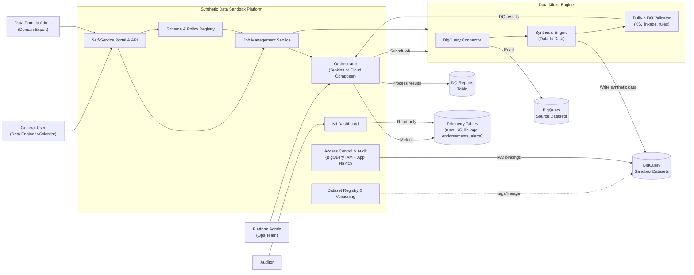
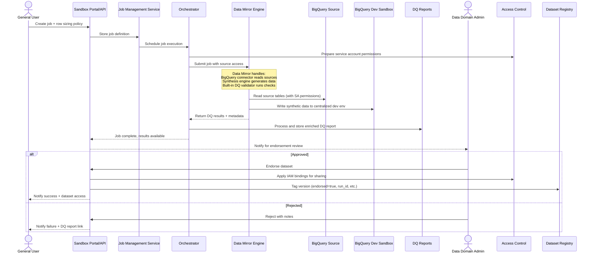
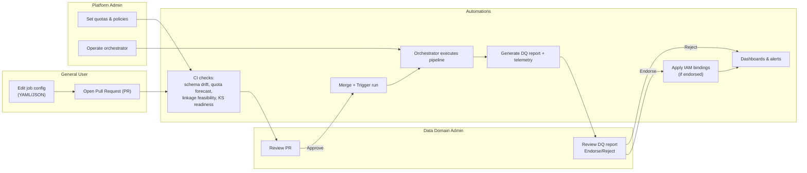
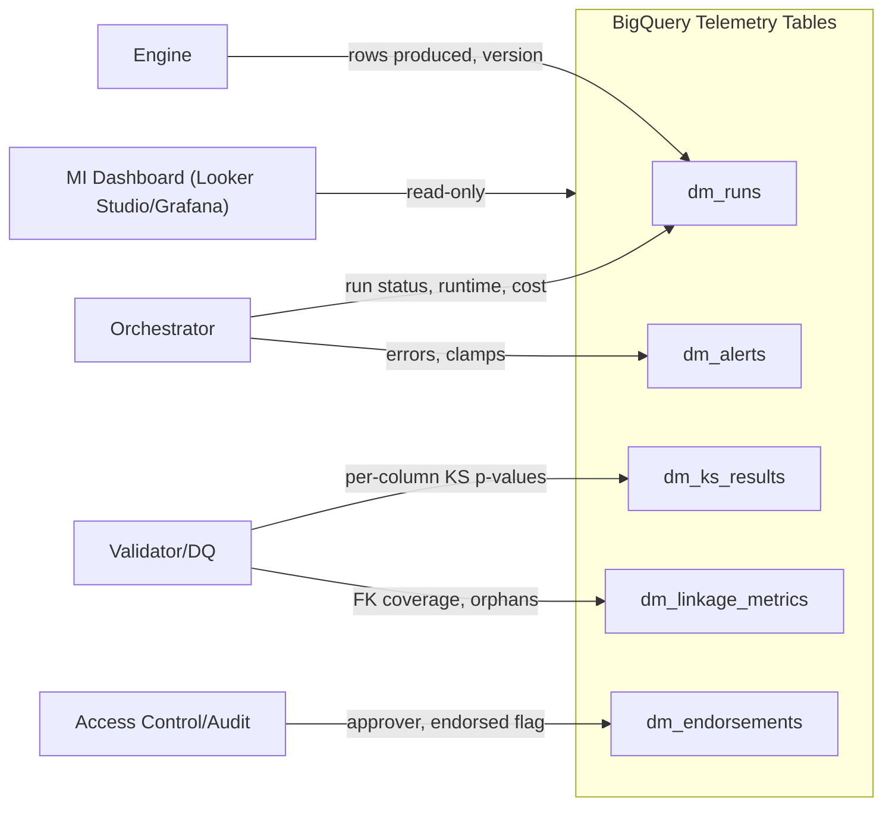

# Synthetic Data Sandbox (Built on Data Mirror Engine)

This document proposes a BigQuery‑centric synthetic data sandbox platform that leverages the Data Mirror engine for synthetic data generation, with integrated governance, access control, and management capabilities.

Notes on terms (plain language)
- Data Mirror: the synthetic data generation engine that reads BigQuery source data and produces synthetic datasets with preserved relationships and statistical properties.
- Synthetic Data Sandbox: the governance and access platform built on top of Data Mirror that provides job management, data quality validation, endorsement workflows, and controlled distribution.
- BigQuery: Google Cloud's managed data warehouse used as both the source and the destination.
- Data→Data synthesis: create synthetic data by learning patterns directly from existing BigQuery tables.
- Primary Key (PK): column(s) that uniquely identify a row.
- Foreign Key (FK): column(s) that point from one table to another, defining relationships.
- Role‑Based Access Control (RBAC): permissions granted based on a person's role (for example, admin vs. general user).
- Identity and Access Management (IAM): Google Cloud's permission system that controls access to BigQuery and other resources.
- Kolmogorov–Smirnov (KS) test: a statistical test that compares two distributions. We use the p‑value from the KS test to decide whether a synthetic column is sufficiently similar to its source column.

---

## 1) Objective and Scope

- Objective: Build a governed synthetic data sandbox platform on top of the Data Mirror engine to enable safe, scalable experimentation and model development with high‑quality synthetic tabular data.
- Scope:
  - Data type: tabular only (Data Mirror limitation).
  - Engine: Data Mirror handles synthetic data generation with BigQuery connectors.
  - Platform: Synthetic Data Sandbox provides governance, job orchestration, quality validation, endorsement workflows, and controlled distribution to a centralized BigQuery dev environment.
  - Orchestration: Jenkins or Google Cloud Composer (managed Apache Airflow).
  - Usage modes: self‑service (users run their own jobs) and managed (admins schedule runs for teams).

**Initial POC Plan (Data Lens Approach)**
- Starting point: onboard four core financial data assets as a "data lens" with fixed sizing for predictable, consistent synthetic data generation.
- Assets: party (customers/organizations), account (bank accounts/cards), product (financial products/services), payment (transactions/transfers).
- Fixed scale: 100,000 synthetic records per asset (400,000 total records per run) to provide realistic volume while maintaining manageable cost and processing time.
- Relationship focus: test Data Mirror's ability to preserve primary key/foreign key relationships across the customer journey (party → account → product → payment).

---

## 2) Key Capabilities

**Data Mirror Engine (foundation)**
- BigQuery connector: reads source data when proper service accounts are shared.
- Data→Data synthesis: learns patterns and relationships from BigQuery source tables and generates realistic synthetic rows.
- Relationship preservation: maintains PK/FK links and business rules.
- Quality validation: built‑in data quality checks based on established criteria (completeness, conformity, validity, uniqueness, metadata consistency, similar distribution via KS test, identical linkage).
- Centralized distribution: outputs synthetic data to a centralized Google Cloud BigQuery dev environment.

**Synthetic Data Sandbox Platform (governance layer)**
- Self‑service portal and API: define, run, monitor, and share synthesis jobs; explore summaries and samples of outputs.
- Job orchestration and versioning: every run creates a new dataset version with clear lineage and tags.
- Data Quality (DQ) report and endorsement: each run produces a report; a domain expert reviews and endorses before the dataset is marked as trusted.
- Access control and sharing: role‑based permissions with controlled dataset sharing and IAM binding management.
- Management insights dashboard: monitor health, quality, cost, and adoption across all jobs and domains.

---

## 3) People and Permissions

Roles and responsibilities
- General User (data engineer or data scientist)
  - Create, edit, and run their own synthesis jobs; view history; share jobs and outputs with specific users or groups in their domain.
- Data Domain Admin (domain expert)
  - Full visibility within their domain; reviews DQ reports; approves or rejects (endorses) datasets; sets domain policies and thresholds.
- Platform Admin (Data Mirror team and selected tenant administrators)
  - Cross‑domain operations: manage quotas, global policies, templates, generator versions; incident response and break‑glass access.
- Auditor
  - Read‑only access to logs, lineage, approvals, and reports.

Enforcement model
- BigQuery IAM at dataset level: job‑scoped service accounts read only required source tables and write only to target sandbox datasets (least privilege).
- Application RBAC: governs job ownership, sharing, and endorsement actions.
- Audit logging: all job lifecycle events (create, run, share, endorse), IAM changes, and dataset access are recorded.

---

## 4) System Architecture (Sandbox Platform on Data Mirror Engine)

**Data Mirror Engine (existing capabilities)**
- BigQuery connector: reads source data when service accounts are properly shared.
- Data→Data synthesis: generates synthetic rows preserving constraints and relationships.
- Built‑in data quality validation: completeness, conformity, validity, uniqueness, metadata consistency, KS‑based distribution similarity, linkage preservation.
- Centralized output: writes synthetic datasets to a centralized BigQuery dev environment.

**Synthetic Data Sandbox Platform Components**
- Job Management Service: handles job definitions, scheduling, and execution coordination with Data Mirror.
- Schema and Policy Registry: stores schemas, PK/FK relationships, business rules, sensitivity labels, and domain thresholds.
- Orchestrator: Jenkins or Google Cloud Composer to coordinate: job submission → Data Mirror execution → result processing → validation → endorsement → publication.
- Dataset Registry and Versioning: tags Data Mirror outputs with domain, source hash, generator version, run ID, and approval state.
- Access Control and Audit: manages IAM bindings, sharing permissions, and audit logging.
- Portal and API: web interface and REST API for job management, approvals, and dataset exploration.
- Management Insights Dashboard: telemetry and analytics for platform health and usage.

**Data flows**
- Job creation: user defines job in Sandbox portal → job stored in registry → service account permissions prepared.
- Execution: Orchestrator → submits job to Data Mirror with source permissions → Data Mirror reads BigQuery sources → generates and validates synthetic data → outputs to centralized dev BigQuery.
- Post‑processing: Sandbox processes Data Mirror results → generates enriched DQ report → domain admin endorsement → IAM bindings applied → dataset discoverable to intended users.
- Refresh: scheduled re‑runs with versioning and re‑validation.
- On‑demand: parameterized re‑runs within policy limits.

### System Architecture Diagram



---

## 5) Job Definition (what a user configures)

Key fields
- Domain name.
- Input BigQuery tables.
- Column roles (identifiers, quasi‑identifiers, sensitive fields).
- Constraints (PK, FK, business rules).
- Generation parameters (random seed, rare‑category handling, null policy).
- Row sizing policy (see Section 6).
- Target dataset naming and tags.
- Sharing targets (users or groups).
- Gating thresholds (KS p‑value threshold; FK coverage threshold).

Outputs
- Synthetic tables in sandbox BigQuery.
- Data Quality report (scorecard, visuals, and details).
- Lineage and run metadata.

Example job config
```yaml
domain: sales
driver_table: raw.fact_orders
row_policy:
  tables:
    - table: raw.fact_orders
      mode: SCALE_FACTOR
      value: 0.5
      partition_window:
        field: order_date
        last_days: 90
    - table: raw.dim_customer
      mode: DERIVED_FROM_DRIVER
    - table: raw.dim_product
      mode: MATCH_SOURCE
gates:
  ks_pvalue_threshold: 0.05
  fk_coverage_threshold: 0.99
quotas:
  max_total_rows_per_run: 200000000
shares:
  - group:data-science
```

POC Data Lens job config (initial implementation)
```yaml
domain: financial_services
data_lens: poc_financial
driver_table: source.party
row_policy:
  fixed_records_per_asset: 100000
  tables:
    - table: source.party
      mode: FIXED_COUNT
      value: 100000
      asset_type: dimension
      primary_key: party_id
      description: "Customers, organizations, individuals"
    - table: source.account
      mode: FIXED_COUNT
      value: 100000
      asset_type: dimension
      primary_key: account_id
      foreign_keys: [party_id]
      description: "Bank accounts, cards, loans"
    - table: source.product
      mode: FIXED_COUNT
      value: 100000
      asset_type: dimension
      primary_key: product_id
      description: "Financial products, services"
    - table: source.payment
      mode: FIXED_COUNT
      value: 100000
      asset_type: fact
      primary_key: payment_id
      foreign_keys: [account_id, product_id, party_id]
      description: "Transactions, transfers, payments"
relationships:
  - parent: party
    child: account
    cardinality: "1:N"
  - parent: product
    child: payment
    cardinality: "1:N"
  - parent: account
    child: payment
    cardinality: "1:N"
gates:
  ks_pvalue_threshold: 0.05
  fk_coverage_threshold: 0.999  # Stricter for financial data
quotas:
  max_total_rows_per_run: 400000  # 4 assets × 100k each
shares:
  - group:data-engineering
  - group:financial-analytics
  - group:model-development
```

### End-to-End Job Flow



---

## 6) Row Sizing Policy (who decides and how)

Decision makers
- Job Owner proposes sizes per table.
- Data Domain Admin reviews and approves; can override to meet policy goals.
- Platform Admin enforces global quotas and costs.

How to specify
- MATCH_SOURCE: same row count as the source table.
- SCALE_FACTOR (k): k × the source row count (for example, 0.1, 1, 2, 5).
- FIXED_COUNT (N): explicit number of rows.
- PARTITION_WINDOW: rows within a time window (for example, last 90 days), optionally with SCALE_FACTOR.
- DERIVED_FROM_DRIVER (for related tables): size child tables using real parent→child distributions from the chosen driver table to preserve FK coverage and realistic join cardinalities.
- DATA_LENS (POC approach): fixed record count per asset type to create consistent, predictable "views" of synthetic data for proof‑of‑concept validation.

Guardrails
- Per‑table min/max rows and maximum scale factor.
- Per‑domain maximum total rows per run and per day.
- Minimum rows per important category (for example, at least 50–100).
- Auto‑clamp: if a request exceeds a limit, the system reduces it and records the reason in the report.

Practical guidance
- Exploration: 1–10% of source or at least 10,000 rows.
- Model development: the larger of 10,000 rows or 10× the number of features, and ≥ 50–100 rows per key category.
- Performance testing: 1–5× source or a fixed large number to mimic peak load.
- Stable statistics: aim for ≥ 1,000 effective samples per important column or group.
- POC validation (data lens): 100,000 records per core asset provides sufficient volume to test relationship preservation, quality gates, and end‑user scenarios while keeping processing time and costs predictable.

---

## 7) Data Quality, Validation, and Endorsement

Checks and gates (configurable by domain)

A. Completeness
- Required fields are not empty; required partitions exist.
- Example gate: ≥ 99% completeness for required fields.

B. Conformity
- Data follows expected schema and format (types, patterns, allowed values, date formats, length and range).
- Example gate: 100% type conformity; ≥ 99.5% format and allowed‑value conformity.

C. Validity
- Business rules and cross‑field logic hold (for example, amount ≥ 0; start_date ≤ end_date; state matches postal code).
- Example gate: ≥ 99% rows pass all rules.

D. Uniqueness
- Primary and composite keys are unique; near‑duplicates on quasi‑identifiers are flagged.
- Example gate: 0 PK duplicates (or an explicitly agreed tiny tolerance).

E. Metadata consistency
- Output schemas, labels, sensitivity tags, and partitioning/clustering match the registry; lineage and versions are recorded.
- Example gate: 100% alignment or an explicitly approved exception.

F. Similar distribution (KS‑only across all columns)
- Apply the Kolmogorov–Smirnov test to every column. For categorical columns, compare the cumulative distribution of category frequencies (ordered by source frequency or a stable lexical order).
- Decision rule: column passes if KS p‑value ≥ threshold (default 0.05; can use false‑discovery control such as Benjamini–Hochberg).
- Report shows D statistic, p‑value, and pass/fail for each column.

G. Identical linkage (relationships preserved)
- Foreign Key coverage: every child points to a valid parent; orphan rate measured.
- Join cardinality shape: distribution of children per parent remains close to source.
- Example gates: FK coverage ≥ 99%; orphans = 0 in strict mode; acceptable drift for parent→child counts.
- POC financial data: stricter FK coverage ≥ 99.9% to ensure realistic customer journey flows (party → account → payment) for compliance and analytical accuracy.

Endorsement
- A Data Domain Admin reviews the DQ report. If acceptable, "endorsed = true" is recorded with approver, timestamp, and notes.
- Endorsement status is shown in the portal and tagged on the dataset so users can see whether it is trusted.

---

## 8) Operations and Change Management

- Pull‑request (PR) review: job definitions (YAML or JSON) live in a code repository. PRs require review by a Data Domain Admin. Automated checks validate schema changes, quota forecasts, linkage feasibility, and sample size readiness for KS testing.
- Reliability and observability: retries with back‑off; stable run IDs; generator version pinning; dashboards for success rate, runtime, cost per gigabyte, gate pass/fail rates, and endorsement latency; alerts for gate failures, schema drift, clamped runs, and overdue endorsements.
- Cost controls: per‑domain quotas, partition pruning and sampling, retention limits, and scheduled windows.
- Access reviews: regular re‑validation of shares and endorsements; automatic revocation if group membership changes.

### Operations Model and Change Management



---

## 9) Management Insights (MI) Dashboard — Overview

Purpose
- One place for domain admins and platform owners to monitor health, quality, cost, and adoption, with quick links to act (view report, endorse or reject, re‑run, manage sharing).

Global controls
- Filters: domain, time range, job owner, dataset version, and endorsement status.

Top indicators (KPIs)
- Run success rate and median runtime.
- Number and percentage of endorsed datasets.
- KS pass rate (percentage of columns with p‑value at or above threshold).
- Median FK coverage and orphan count.
- Total synthetic rows and percentage of clamped runs.
- BigQuery spend and quota usage.

Primary views
- Overview: trends of runs by status and recent endorsements or pending approvals.
- Data Quality: KS summary and failing columns; pass rates for completeness, conformity, validity, uniqueness; linkage health gauges.
- Row Sizing and Throughput: requested vs. produced rows, clamp reasons, policy modes in use, rows per second by generator version.
- Cost and Quotas: spend by domain and run, bytes processed, and alert thresholds.
- Governance and Access: endorsement backlog against service levels, sharing activity, and recent audit events.

### MI Dashboard Data Flow


