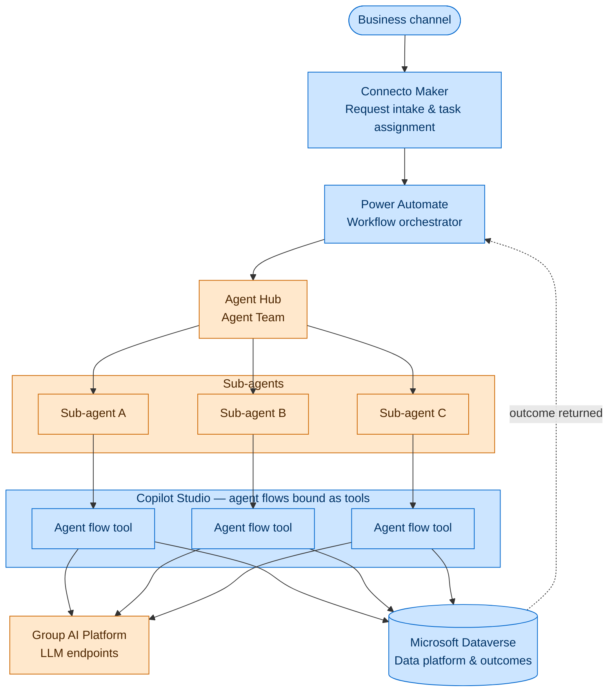

```mermaid
flowchart TD
  BC([Business channel]):::msft
  CM[Connecto Maker\nRequest intake & task assignment]:::msft
  PA[Power Automate\nWorkflow orchestrator]:::msft
  AH[Agent Hub\nAgent Team]:::internal
  DV[(Microsoft Dataverse\nData platform & outcomes)]:::msft

  subgraph SA[Sub-agents]
    S1[Sub-agent A]:::internal
    S2[Sub-agent B]:::internal
    S3[Sub-agent C]:::internal
  end

  subgraph CST[Copilot Studio — agent flows bound as tools]
    T1[Agent flow tool]:::msft
    T2[Agent flow tool]:::msft
    T3[Agent flow tool]:::msft
  end

  GAP[Group AI Platform\nLLM endpoints]:::internal

  BC --> CM --> PA --> AH
  AH --> S1 & S2 & S3
  S1 --> T1
  S2 --> T2
  S3 --> T3
  T1 & T2 & T3 --> GAP
  T1 & T2 & T3 --> DV
  DV -.->|outcome returned| PA

  classDef msft fill:#cce5ff,stroke:#0066cc,color:#003366
  classDef internal fill:#ffe8cc,stroke:#cc6600,color:#4d2600

  class CST msft
  class SA internal
```
