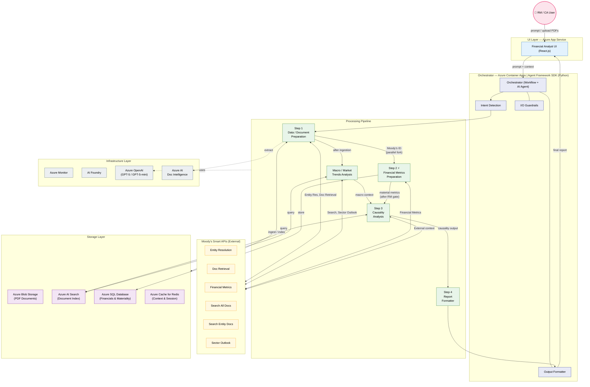
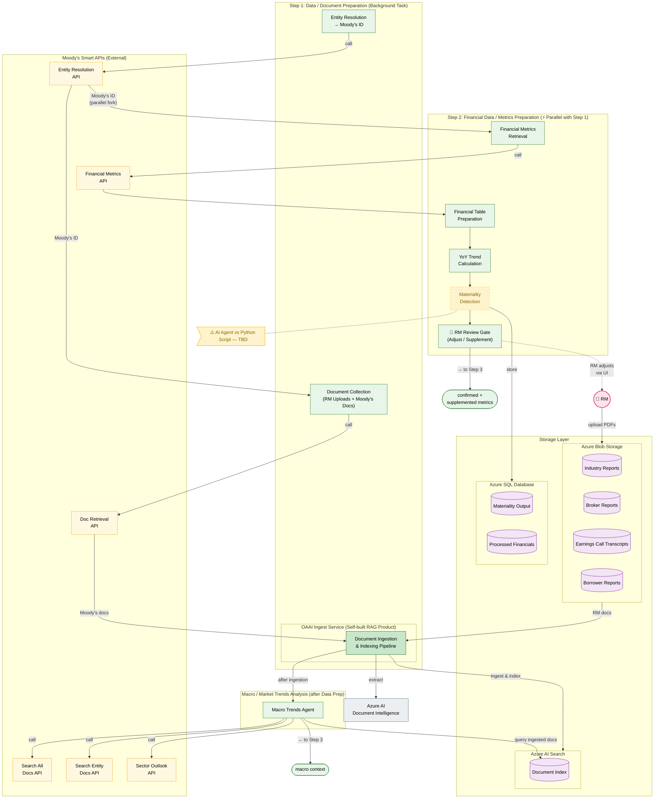
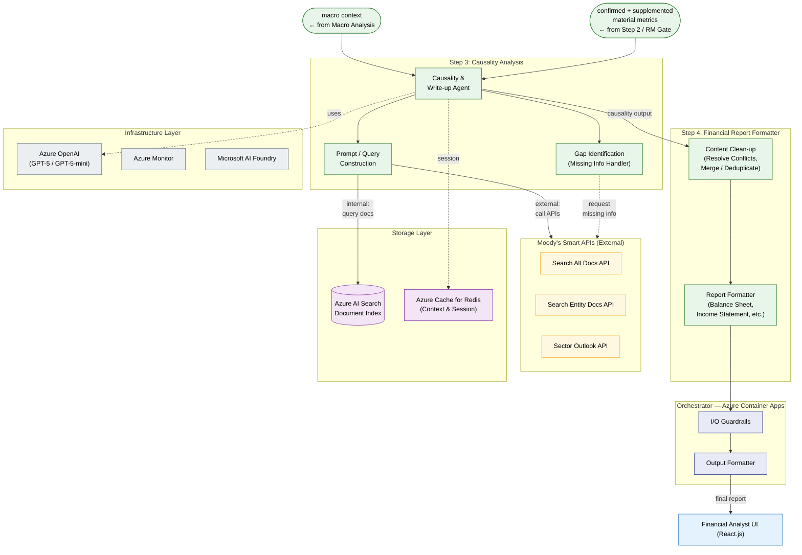

# Financial Analyst — System Architecture

---

## Part 1: High-Level Overview

---

## Part 2: Step 1 & 2 — Data Preparation (+ Macro Analysis)

---

## Part 3: Step 3 & 4 — Causality Analysis & Report Generation

---

## Legend
- **Green nodes** — Processing components (agents, tools, pipelines)
- **Yellow nodes** — Moody's Smart APIs (external)
- **Purple nodes** — Azure storage services
- **Blue nodes** — UI components
- **Indigo nodes** — Orchestrator components
- **Grey nodes** — Infrastructure services
- **Dashed border (⚠️)** — Decision pending (open for discussion)
- **Dashed arrows** — Async / optional / infrastructure dependency
- **Solid arrows** — Primary data flow

## Flow Summary
1. **Step 1** — RM triggers analysis → Entity Resolution (Moody's API) → parallel fork
2. **Step 1 (background)** — Collect docs (RM upload + Moody's) → OAAI Ingest → Azure AI Search
3. **Macro Analysis** — After ingestion: query docs + Moody's Search/Sector APIs
4. **Step 2 (⚡ parallel)** — Moody's Metrics API → Table → YoY → Materiality → RM Review Gate
5. **Step 3** — Causality Agent receives macro context + material metrics → queries internal & external
6. **Step 4** — Clean-up, dedup, format → final report to UI
